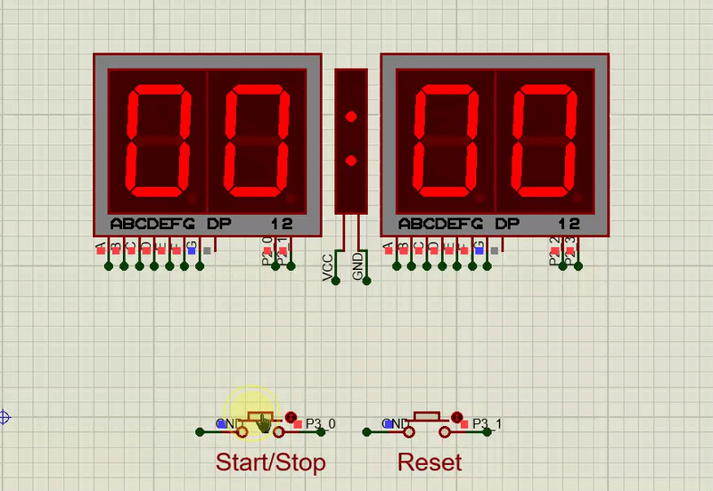

# StopWatch Project for AT89C51 Microcontroller

## Overview
This project implements a simple stopwatch using the `AT89C51` microcontroller with the following features:
- Start/Stop functionality
- Reset capability
- 4-digit 7-segment display showing minutes and seconds (MM:SS format)
- Accurate timing using Timer 0 interrupts

## Hardware Requirements
- AT89C51 microcontroller
- Four 7-segment common cathode displays
- Two push buttons (Start/Stop and Reset)

## Software Implementation
- Developed using `Keil µVision` IDE
- Written in C language 
- Uses Timer 0 interrupt for accurate timing
- Implements multiplexing for 7-segment displays

## Simulation
The project has been simulated in Proteus with:
- Virtual AT89C51 microcontroller
- 7-segment display components
- Push button components

## How to Use
1. Open project in Keil µVision
2. Build the project to generate HEX file
3. Load HEX file into AT89C51 in Proteus simulation
4. For real hardware, program the HEX file onto the AT89C51 chip

